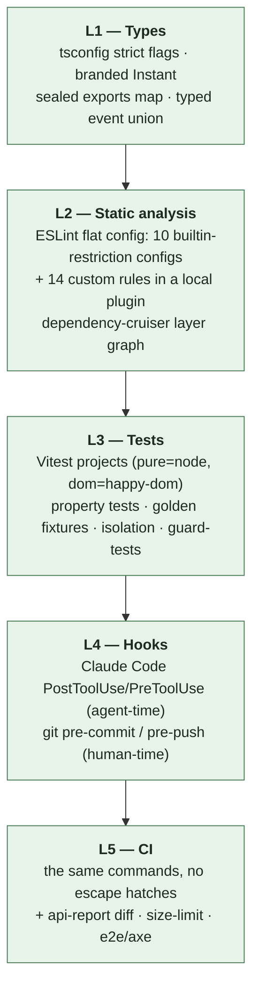

# FreeGantt — Guardrails Overview

**Status:** Shipped. This folder specifies the enforcement system that `plans/04` §3–§4 calls for, and every layer below runs: 14 custom rules in `eslint/rules/`, 15 guard suites in `test/guards/`, and the whole gate runs in CI on every change (`04-hooks-and-ci.md`).

**What this folder is:** the answer to "how do we make the rules in `plans/00`–`04` and `CLAUDE.md` *deterministic* — machine-checked, failing loudly, on every change — instead of things a reviewer has to remember."

| Doc | Contents |
|---|---|
| `00-guardrails-overview.md` (this) | Philosophy, the five defense layers, what is deliberately *not* automated |
| `01-invariant-guard-matrix.md` | Every rule in the spec → its mechanism → its CI job → honest status |
| `02-lint-rules.md` | Spec for each custom ESLint rule: what it bans, allowlist, message, fixtures |
| `03-boundaries-and-config.md` | dependency-cruiser, tsconfig, `exports` map, Vitest projects, package checks |
| `04-hooks-and-ci.md` | Git hooks, Claude Code hooks, the CI pipeline, guard-test meta-suite |
| `05-consumer-api.md` | Index for app authors — links README, `plans/02`, glossary, export report, S4 surface |
| `06-plugin-authoring.md` | Plugin authoring guide — the two-halves shape, every registration seam, disposal |
| `07-row-source-updates.md` | How to change one `rowSource` setting and keep the rest |
| `08-a-bar-is-an-entry.md` | ADR-adjacent record of #421: a Bar is one child Entry by default |
| `edit-extension-flow.md` | The extension hook — flow and sample usage for `data/edit-extension.ts` |

---

## 1. Principle: a rule that isn't executable is a wish

`plans/04` §4 already states the standard: *"Every invariant in `01` §11 must name the CI job that enforces it; an invariant without a job is a TODO, tracked in the table itself."* This folder extends that standard from the 14 numbered invariants to **every hard rule in `CLAUDE.md`**, and adds three commitments:

1. **Every guard is itself tested.** A lint rule with no failing fixture is indistinguishable from a lint rule that silently matches nothing. `plans/04` §3.2 already demands this for the layer boundary ("the red test — prove the gun is loaded"); we generalize it to all guards (`04-hooks-and-ci.md` §4).
2. **Guards fail at the earliest layer that can catch them.** A violation caught by the type system costs seconds; by an editor lint, a minute; by CI, ten minutes; by review, a day; by a user, a release. Push every rule down the stack as far as it will go.
3. **Where a rule genuinely cannot be automated, it is labeled `REVIEW-ONLY` in the matrix with a one-line reason.** No rule is allowed to be silently unenforced. Two of them (I5 hot-path allocation, part of I12) are on that list today, with the partial mechanical proxies named.

## 2. The five layers of defense



L4 is a *convenience* layer: it runs a fast subset of L2/L3 early, for the agent and for the human. It is never the only place a rule lives — a rule enforced solely by a git hook is a rule that dies the first time someone passes `--no-verify`. **CI is the authority; hooks are the fast feedback.**

## 3. Ownership of each spec source

| Source | Rules it contributes | Primary mechanism |
|---|---|---|
| `plans/01` §1 layer map | I1, D4 isolation, pure-layer DOM freedom | dependency-cruiser + `no-restricted-globals` + Node-env test project |
| `plans/01` §5 time policy | I10, half-open storage | 3 lint rules (2 builtin-restriction, 1 type-aware custom) |
| `plans/01` §6 data | transactions-only mutation, no singletons (I2) | 2 custom lint rules + isolation test |
| `plans/01` §7 scheduling | I3, I4 | recursion lint rule + 5k fixture + fast-check purity property |
| `plans/01` §8 render/view | I12, I13, reconciler scope | 3 custom lint rules + reconciler unit tests |
| `plans/01` §2.5 kinds | no `if (kind === …)` outside seams | custom lint rule with seam allowlist |
| `plans/01` §11 | I1–I14 | the matrix in `01-invariant-guard-matrix.md` |
| `plans/02` | naming pairs, no "not implemented", JSON contract | event-pair test + api-report diff + custom lint rule |
| `plans/04` §1 | exactly one runtime dep | package-shape test + import allowlist |
| `CLAUDE.md` | vendor-name ban (ADRs exempt), workflow rules | repo-wide grep check |

## 4. What we deliberately do **not** automate

Recording these so nobody later mistakes the gap for an oversight:

- **"Is this the right design?"** Guards enforce the *decided* architecture; they cannot tell us a decision was wrong. Locked decisions D1–D12 change by editing `plans/`, not by adding an exception to a lint rule. When a guard is fighting the code, the correct first question is "is the code wrong?" and the correct second is "should the spec change?" — never "let me add an eslint-disable."
- **Coverage as a quality target.** One coverage gate exists (>90% on `scheduling/`, per S7 acceptance) because that module is pure logic with golden fixtures. No global coverage threshold: it drives test-shaped-noise, not correctness.
- **Formatting debates.** Prettier decides, nobody reviews it, `--check` in CI.
- **Performance budgets before S6.** Budgets that predate a measured spike are guesses (D2). The *jobs* are scaffolded early and non-blocking; they gate at S6.

## 5. Escape hatches, and their price

There is exactly one sanctioned way to bypass a custom rule: an inline disable **with a reason comment naming the spec section that permits it**.

```ts
// eslint-disable-next-line freegantt/no-date-outside-time -- time/zone.ts is the sanctioned Intl boundary (plans/01 §5.3)
```

A dedicated CI job (`disables`) collects every `eslint-disable` for a `freegantt/*` rule and fails if one lacks a ` -- ` reason. The count is printed in the job summary, so growth is visible in review. Disables of the layer graph (dependency-cruiser) are not available inline at all: the graph is edited in one file, in a reviewed commit, or not at all.

### 5.1 `isDevMode()` is not an escape hatch, and "warn in dev mode" is the phrase to distrust

`isDevMode()` (`src/data/dev-mode.ts`) reads `import.meta.env.DEV`. That is not a runtime question. Vite replaces it with a literal when the code reading it is built, and the code reading it is **this library** — so the value is fixed when this repo builds `dist/`. A consumer's own dev server never re-evaluates it. Their development build and their production build both receive `false`.

**Never gate anything a consumer needs to see.**

A diagnostic behind this flag is not a warning that appears in development. It is a warning deleted from the product. It is worse than an omission, for three reasons that compound:

- It reads as deliberate. A reviewer sees an intent that the mechanism does not deliver.
- Our tests run with `DEV === true`, so the gated branch is the only branch they exercise. The suite is green and proves nothing about what a consumer gets.
- Nobody reports the absence. A consumer cannot miss a line they have never seen.

This has bitten three times. `'scale-options-ignored'` and the corrected-rollup report were both gated, and no consumer ever received one (D-S5-41). `'variant-matched-twice'` was written the same way and caught in review before it shipped (J33, `plans/field-redesign/BUILD-LOG.md`). All three were specified as "warn in dev mode", which is why that phrase is the signal: it names an intent this flag cannot carry.

**What it is legitimately for:** making *our own* development stricter, at a cost we do not want to charge a consumer. `transaction.ts` deep-freezes a ChangeSet so our tests catch a mutation. `build-commit-change-set.ts` asserts an extension hook did not overwrite the body. Both would still be correct if they never ran anywhere else. The test is: *would a consumer want this?* If yes, it must not be gated.

**The replacement, when the answer is yes:** raise it through `raiseError` at `severity: 'warning'`, in every build. When the real concern is cost rather than noise, remove the cost by not asking the question — `produce-bars.ts` stops its claim scan at the first match when no report sink is wired, rather than gating the report.

## 6. Implementation order

Guardrails land before the code they guard (`plans/04` §3, "the S0 order of operations"). Concretely:

1. tsconfig + prettier + eslint baseline (typescript-eslint recommended-type-checked) — **S0, step 2**
2. dependency-cruiser graph + its red test — **S0, step 4** (before any `src/` code)
3. The local ESLint plugin with the 8 rules whose targets exist at S0 (`02-lint-rules.md` §5 phasing table) + RuleTester fixtures
4. Vitest `pure`/`dom` projects + the guard-test suite
5. Git hooks + Claude Code hooks (cheap, once the commands exist)
6. CI workflow wiring all of it — **the same commands the hooks run**

Rules whose subject matter doesn't exist yet (e.g. `no-store-mutation-outside-transaction` before `data/` exists at S2) are written when their slice starts, but their *row in the matrix exists now* with status `PLANNED (S2)`, so the gap is tracked rather than forgotten.
