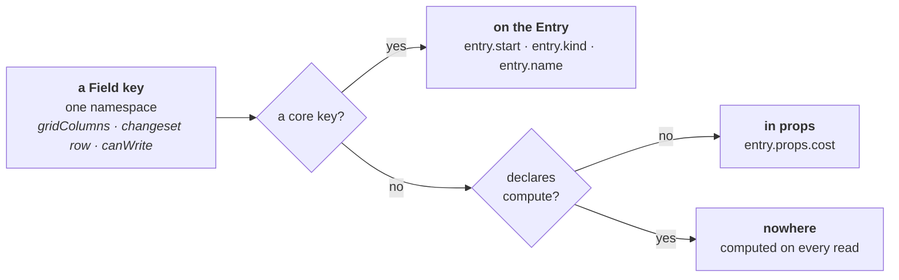
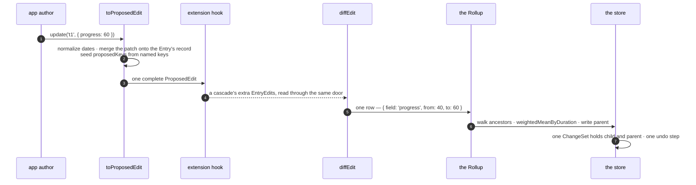

# Consumer values live in `props`

> **One sentence here is retired.** *Decision 13* named a rename of `fieldValue` to `read` and the deletion of `durationOf`. That was ADR 0014's, and the author withdrew ADR 0014 on 2026-09-11 before it was built ([the gap at 0014](README.md#the-gap-at-0014)). `entries.fieldValue` is what `src/` ships. [ADR 0017](0017-the-entry-answers-questions-about-itself.md) now owns the read door, as `entry.read(key)`. **The decisions this ADR took itself all stand**, and the body stays written.

**This is the ADR that simplifies the API.** It grew to 25 decisions and split into five on 2026-09-09, by question rather than by file. The other four are [0012 — optional dates](0012-dates-are-optional-on-every-kind.md), [0013 — what decides derivation](0013-what-decides-that-a-row-derives-its-values.md), [0014 — the plugin-author surface](README.md#the-gap-at-0014) and [0015 — what the write door refuses](0015-what-the-write-door-refuses.md). The map is [`plans/field-redesign/README.md`](../../plans/field-redesign/README.md).

| File | Read it when |
|---|---|
| [`plans/field-redesign/0011-consumer-values-in-props/`](../../plans/field-redesign/0011-consumer-values-in-props/README.md) | You want the open decisions, the closed ones, or the work |
| [`…/types.md`](../../plans/field-redesign/0011-consumer-values-in-props/types.md) | You are about to write the edit types or the Field union |
| [`…/api.md`](../../plans/field-redesign/0011-consumer-values-in-props/api.md) | You want the call sites, before and after |
| [`…/shared/refuted.md`](../../plans/field-redesign/shared/refuted.md) | You are about to re-derive something. Check here first |

## Context

ADR 0005 gives a consumer Field a declaration and no home. `FieldSource`'s stored arm is `{ from: 'entry'; field: CoreFieldKey }`, and `CoreFieldKey` is `keyof Omit<Entry, 'id'>`. So `source: { from: 'entry', field: 'cost' }` is a type error, and every consumer value lands in `meta`. ADR 0005 promises that `'start'` and `'cost'` take one code path. The promise holds for the declaration and fails for the storage. The half a consumer cannot reach is the half that works.

The bag then costs more than it pays.

| What goes wrong | Where |
|---|---|
| `update('t1', { cost: 7 })` merges and keeps `owner`. `update('t1', { meta: { cost: 7 } })` replaces and drops it. Both compile, and the destructive one reads better in English | the write door |
| A `meta` holding an array is replaced by an object, because `metaRecord` answers `{}` for an array | `metaRecord` |
| Two generics name one set of values and nothing links them | `harness/planner.ts:31` — the two halves disagree about `critical`, and nothing notices |
| Every read of a `meta` Field allocates, because `metaStrategy.read` spreads the bag for one property lookup | `metaStrategy.read` |
| `meta` names four things at once: a storage location, a Field key, a `FieldSource.from` value, and a Document key | `entry.meta`, `CORE_FIELDS`' `meta` row, `FieldSource.from: 'meta'`, `EntryDocument.meta` |

## Decision

**A number in the field redesign is always a decision number.** These sections carry no numbers, so *decision 1* is the undeclared-key question and never the first section. Cite a section by its title.

### A Field key is the whole address

`{ key: 'cost' }` reads and writes `entry.props.cost`. `{ key: 'start' }` reads and writes `entry.start`. Nothing declares a `source`. The key decides the home, and which home that is stays the library's business. **Declaring a key does not create it. Declaring says what the library may do with it.**



**One key space, two homes.** One name serves `field` on a changeset row, `canWrite(entry, field)`, and `gridColumns: ['name', 'cost']`. Storage is namespaced underneath. A consumer key cannot shadow a core key, and a core key added in a later release cannot land on a consumer's value.

`FieldSource` retires with all three arms. `meta` is renamed to `props` on `Entry` and `EntryInput`. There is no `EntryDocument`. The `meta` **core Field** is deleted with no successor, because a whole bag is not a value a grid shows or a Rollup aggregates. The name `props` is decision 17, closed — see [0011 closed decisions](../../plans/field-redesign/0011-consumer-values-in-props/README.md#closed-decisions).

### The library writes into `props` only at a declared `rollUp` key

The Rollup writes a derived value into the consumer's own bag. That is the same shape as a library writing into a consumer's namespace, and the field reports on that shape are bad (see [`evidence.md`](../../plans/field-redesign/shared/evidence.md), the Vaadin rename). It is safe here for one reason: the consumer asked for it, in the declaration.

**An undeclared key is never written by the library, ever.** State this wherever `props` is documented. Without it, decision 9's *prefix the plugin* mitigation looks complete, and it is not — a plugin is not the only second writer in the bag.

### An update is flat, `add()` is flat, constructor ingest may nest, and `props` merges

`update(id, { start: '2026-01-06', owner: 'Sam' })` writes one date and one consumer value. Every other key in `props` survives. Nesting is not what makes today's write destructive; **replacing** is. **Decision 11, closed 2026-09-10, extended 2026-09-10 (grill):** `add()` takes the same flat shape. `props:` is refused at `add()` and at `update()`. Constructor `entries` may still nest `props` for passengers.

**Q15, closed 2026-09-10 (grill).** Constructor `entries` take declared Field keys at the top, the same as `add()`. Nested `props` stays legal on a constructor record for passenger keys and for a bag you already hold. Unknown top-level keys **warn and are ignored** — ingest, not a throw. There is no `fromJSON`. A declared key named both at the top and inside `props` throws.

`toProposedEdit` merges the patch onto the Entry's own record, so a `ProposedEdit` always carries a **complete** `props`. The merge sits on the read side, not the apply side. An explicit `undefined` inside a patch clears that one key.

**The patch merges one level deep, and never recurses.** `update(id, { address: { city: 'Ely' } })` replaces the whole `address` object. The reason is the ChangeSet, not convenience: a row is `{ field, from, to }`, and `field` is a Field key. `props.address.city` is a name no Field key carries, so no row describes it, no undo replays it and no subscriber observes it. **A patch may only name what the model can name.** A consumer who wants a nested value tracked declares it as its own Field key.

The types, and why each one is shaped as it is, live in [`types.md`](../../plans/field-redesign/0011-consumer-values-in-props/types.md).


### The write resolver moves into `data/`, and its policies do not change here

Three rules meet at one question — does this Field exist, is it editable, is it derived here. **`data/` exports one resolver.** Do not re-ask the question in a second place.

**The resolver is a move, not a build.** `view/capability.ts:113-121`'s `libraryWriteRule` already holds the editable and derived arms in one function, and already imports `rollsUp` from `data/` (`field-registry.ts:97` — it already lives there). `entry-store.ts:358` already throws `UnknownFieldError` for the third.

This ADR moves that function into `data/` and stops `view/capability.ts` restating the rule. `view/capability.ts` calls the moved function. **`entries.update()` keeps HEAD's `UnknownFieldError` only.** It does not call the editable or derived arms. **No policy changes, so no decision is spent here.**

Then [ADR 0013](0013-what-decides-that-a-row-derives-its-values.md) fills the derived arm and wires `entries.update()` (and the ingest drop doors) to it. [ADR 0015](0015-what-the-write-door-refuses.md) fills the editable arm and wires `entries.update()` to it. **One function, three owners, one at a time.** Do not wire `entries.update()` to a policy this ADR did not rule.

The six call sites and the throw-versus-drop table — `update()` refuses, `add()` / the constructor drop — belong to [0013](0013-what-decides-that-a-row-derives-its-values.md) (derived) and [0015](0015-what-the-write-door-refuses.md) (editable). `fromJSON` went with [ADR 0016](0016-the-library-holds-no-save-format.md). Do not claim I14 until 0015 has wired the editable arm.

### Two doors read one value, and each answers a different question

```ts
dataset.entries.get('t1')?.props.owner       // the stored bag, typed by TProps
dataset.entries.read('t1', 'owner')          // any Field key: core, compute, plugin
```

The record door returns storage. The by-key door resolves getters and aggregates. Every comparable library publishes the same pair.

**Two on the app-author surface.** The plugin surface uses the same name: `ctx.read(entry, key)`. [ADR 0014](README.md#the-gap-at-0014) decision 13 renamed `fieldValue` to `read` and deleted `durationOf`. Duration is a compute Field; you read it through `read`.

**The by-key door keeps its type.** `FieldValue` maps over the **generic**, never over the registry, so one generic carries `model/dataset.ts:41` across unchanged as `FieldValue<TProps, K>`. Two value classes stay `unknown`, and both own no `TProps` key — a `compute` Field's answer, and a plugin's Field. That residue is [#267](https://github.com/Pawel-IT/FreeGantt/issues/267).

**Declare a Field when the library has a job to do with the value, not to make the value exist.** A `phase` that only a bar renderer reads needs no type bundle, no rollup, no editor and no column, so it needs no Field. **It is not writable through `update()` without one** — decision 1, ruled 2026-09-10. Carrying the value is free; changing it is what needs the declaration.

**The Field union is exclusive.** A stored Field may roll up and may be edited. A computed Field may do neither. A `compute` Field runs on **every** row, a rolling-up parent included — decision 10, closed. The union closes *storage*, not *reading*. The real limit is that a `compute` Field cannot ask *am I a parent?*, which is [#214](https://github.com/Pawel-IT/FreeGantt/issues/214). The union's declaration, and what it does and does not enforce, are in [`types.md`](../../plans/field-redesign/0011-consumer-values-in-props/types.md).

**A `compute` arm takes the row and the context, and each carries what the other cannot.** `entry.props.x` reaches a stored consumer value and nothing else — not a core key, not `duration`, and not another Field's `compute` arm. `ctx.read(entry, key)` reaches all three. **Read a _value_ through `entry.props`, and read a _Field_ through `ctx.read`.** The name is `compute`, not `get`: `get` already names three unrelated jobs here, and `compute` keeps the vocabulary `source: { from: 'compute' }` already teaches.

## The flow, once

`dataset.entries.update('t1', { progress: 60 })`, on a child of a rolling-up phase.



**Step 1 seeds `proposedKeys` from the named keys of the edit.** Decision 11 put declared consumer keys at the top level, so the walk is one `Object.keys(edit)` against the registry. An undeclared key is never among them: decision 1 ruled that `update()` naming one throws `UnknownFieldError`. Ingest still walks **inside** `props` on the record.

**Step 5 emits one row per Field key, never a path into `props`.** Today a whole-`meta` write emits two rows for one value — one for `meta` itself, one for the key inside it. The `meta` Field is deleted, so the second row has nothing to come from.

**Step 7 is [ADR 0013](0013-what-decides-that-a-row-derives-its-values.md)'s.** Nothing but the Rollup writes a rolling-up parent's cell. `reportCorrectedRollUps` went with [ADR 0016](0016-the-library-holds-no-save-format.md). Do not delete it here — it is already gone.


## Considered options

| Option | Verdict |
|---|---|
| **Flat consumer properties on the Entry**, in one key space with `start` | **Rejected, and re-confirmed 2026-09-10.** One gain — a single storage home — charged at four places. [ADR 0016](0016-the-library-holds-no-save-format.md) voided two of them by deleting the save format: the Document reader's unknown-key rule inverting, and an older file needing a migration door for a promoted consumer key. **Two charges carry the decision on their own, and neither mentions serialization:** three reserved name sets appear at three doors, and `Entry` needs an index signature, which makes `entry.strat` compile. The author ruled `props` stands |
| **Flat consumer keys on the edit alone**, with `props` everywhere else | **Accepted as decision 11, 2026-09-10.** The first draft rejected this because the object a consumer writes most often would disagree with the object the library holds. Decision 1 already splits those doors: ingest carries, `update()` names. The author ruled the call `plans/02:467` already teaches: `update('t1', { start, cost })`. Nest is refused at `update()`. |
| **Keep the namespace under its current name, `meta`** | **Rejected.** `meta` names four things — the Context table above — and three of them go here. It is also the wrong word: *meta* says *about the data*, and the contents are the data |
| **Keep the namespace in the Document only**, flat at runtime | **Rejected.** The reader and the writer would each move every consumer key across a boundary, and every seam between them would have to know which side it stood on |
| **Keep `meta` and open `FieldSource`'s entry arm to any key** (the small fix) | **Rejected.** The declaration keeps an address the library should own, so the strategy table, the second generic and the whole-bag write all survive. The bag stops being mandatory and stays available — the worst of both |
| **Read consumer values through an accessor and never store them** | **Rejected.** Reads alone carry four of the planner's five fields, and a Gantt that edits, undoes and aggregates a consumer value has to hold it |
| **A nested accessor path** (`accessor: ['finance', 'approved']`) | **Deferred.** It costs a compiled reader, an immutable path writer, path equality, undo through a path and a Document rule. It is an additive optional key whenever a real consumer needs one |
| **Publish an ownership ladder now** (managed, custom setter, controlled writes) | **Rejected for this ADR.** It is an escape hatch from a storage model being replaced. Revisit when a consumer asks |
| **`internal: true` for `parentId` and `segments`** | **Rejected.** An absent `column` means no shorthand defaults. A bare key with no defaults throws `FieldColumnNotDefinedError`. A column object still shows the Field. A second key for one job breaks *one config tree per job* |

## Consequences

**Storage and types**

- **The write path is the one that already exists.** `metaStrategy.write` already builds a complete record from the Entry's own values plus the one key it is given, and `diffEdit` already emits one changeset row per declared key through `proposedKeys`. Deleting the strategy table removes a **dispatch**, not a mechanism. **This is the remaining half of the change.** ADR 0016 took the Document rename. The write path and the type renames remain. The derived-value rule is [ADR 0013](0013-what-decides-that-a-row-derives-its-values.md). Optional dates are [ADR 0012](0012-dates-are-optional-on-every-kind.md).
- **This ADR declares `ComputedFieldCannotBeWrittenError` and throws it at registration** — `compute` beside `rollUp`, or `compute` beside `editable`. [ADR 0013](0013-what-decides-that-a-row-derives-its-values.md) declares and throws `DerivedFieldNotWritableError`. [ADR 0015](0015-what-the-write-door-refuses.md) declares and throws `FieldNotEditableError`, and throws `ComputedFieldCannotBeWrittenError` at `entries.update()`. Every new error is a named `FreeGanttError` with a `code:` and a `plans/02` §7 row.
- **`props` is the one reserved key in this ADR, and there is no reserved *set* yet.** `{ key: 'props' }` throws at **runtime** only. `FieldKey` is `CoreFieldKey | (string & {})`, so the literal type-checks — that is the brand doing its job, and it is written here so nobody later "fixes" `FieldKey` into a closed union and flattens the brand. **Decision 11 puts declared consumer keys at the top level of an edit.** `UnknownFieldError` (decision 1) is the guard. A published reserved list of **core** keys is [ADR 0014](README.md#the-gap-at-0014) decision 12, closed 2026-09-10 — core keys stay bare, plugin keys carry a prefix.
- **`CoreFieldValues` omits `'props'` alongside `CoreFieldKey`, or neither does.** `model/field.ts:19` is `Omit<Entry, 'id'>` and `FieldValue` resolves its first arm against it. Change one and not the other, and `read(id, 'props')` **types as the whole bag** while the runtime throws. It is public at `api/index.ts:57`.
- **The internal `Entry` describes its own object.** `props` defaults to `Readonly<Record<string, unknown>>`, so `entry.props.phase` compiles inside `layout/` and `view/` and answers `unknown` under `noUncheckedIndexedAccess`. No cast, no index signature, and `entry.strat` still fails to compile. `Entry` stays non-generic in those layers, which is what ADR 0005 ruled.
- **`Entry.props` is always present; `EntryInput.props` is optional.** Ingest fills `{}`, the same rule `segments` already follows, so no reader carries a "no props" branch.
- **`TProps` says which keys may exist, never which keys must.** `props` is `Partial<TProps>` at every door. `Readonly<TProps>` beside an ingest fill of `{}` is a lie the compiler cannot see, and a required key cannot survive a door that accepts `add({ id })`.
- **`props` is copied at ingest, and immutable afterwards.** Deleting `metaRecord` would otherwise leave the store holding the consumer's own object, and a consumer mutating their input array would mutate the store outside a transaction, outside the ChangeSet and outside undo. Ingest takes a shallow copy, and a read becomes one property lookup — which is what the deletion was for.
- **One generic, written by hand, and it types two things.** `Dataset<ConsumerEntryProps>` types `entry.props` and the `props` patch. The `harness/planner.ts:31` disagreement becomes unrepresentable. Inferring the shape from the `entries` array stays possible later and is no longer load-bearing.
- **A removal is an ordinary write.** The stored record loses the key rather than holding `undefined`, so `'owner' in entry.props` is the removal test and a reader does not carry two absent shapes. The row is `{ field: 'owner', from: 'Jo', to: undefined }`, so undo restores the key by replaying `from`. The removed key **sits in `proposedKeys`**: an extender reading `EditRequest.proposed` has to see a proposal rather than an absent key.
- **The library does not read `null` as a removal.** A patch that arrives as JSON — from a server, from a form — cannot say *remove*. A consumer who accepts wire patches translates `null` to `undefined` at their own edge, or calls `update` twice. Reading `null` as a removal would buy wire compatibility by forbidding a stored `null` forever. The reasoning against RFC 7396 is in [`evidence.md`](../../plans/field-redesign/shared/evidence.md).

**Ingest**

- **Constructor ingest carries undeclared keys inside `props`.** An unknown top-level key warns and is ignored. There is no Document reader — [ADR 0016](0016-the-library-holds-no-save-format.md). ADR 0008's ruling stands: a legacy `progress` is consumer data inside `props`, with no core key to collide with.
- **An unknown top-level key at ingest raises a warning, and the key is ignored.** `EntryInput` is closed, so the compiler already refuses one in a written literal. Data arriving from a server is the real case. Throwing turns one uninteresting column into a crash, and silence hides a typo'd `strat`. The check is one `Object.keys(input)` walk per Entry against `CORE_FIELDS` plus `'props'` — no second list to keep in step.
- **A `props` key that names a core key gets the same warning, and the core definition wins.** Ruled 2026-09-09. `entry.props.start` would store without complaint and then be unreachable, because `read(id, 'start')` answers the Entry's own `start`. The value is ignored and it never throws — a consumer feeds this Dataset from an API they do not own, and a column added upstream must not break their page. **One sentence, one loop: a key inside `props` never names a core key, and a key at the top level is never a consumer's.**
- **An undeclared key is carried, and `update()` never names it.** Decision 1, ruled 2026-09-10. It stores at constructor ingest and is never dropped; `update()` naming one throws `UnknownFieldError`. **A Field declaration is a handling contract, not a storage permission** — declare a key and the library sorts, formats, rolls up, tracks and writes it; leave it undeclared and the library carries the value and handles nothing. No flag marks a carried key: keeping it costs nothing, because a value that never changes needs no `equals`, no ChangeSet row, no row order and no undo entry. **Two consequences follow.** A passenger key cannot be removed through `update()`, so it lives as long as its Entry. And `entryAfterEdit` and both merge functions must merge `props` **per key** — a shallow spread deletes every passenger key the other edit did not restate.
- **No schema number.** [ADR 0016](0016-the-library-holds-no-save-format.md) deleted the Document. This ADR's Document rename is gone; the write path and the type renames remain.
- **`props` is carried by reference.** [ADR 0013](0013-what-decides-that-a-row-derives-its-values.md) adds the one exception, on a rolling-up parent.

**Deletions and renames**

- **The deleted surface.** `FieldSource` and all three arms, the `meta` core Field, `DuplicateFieldSourceError`, `InvalidFieldSourceError`, `source-strategy.ts`'s strategy table, `normalize-source.ts`, `metaRecord`/`metaKey`/`metaSlot`, and `Field.source`. (`SerializedField` went with ADR 0016.) `reportCorrectedRollUps` is already gone — do not delete it here. `TMeta` becomes `TProps` and loses its second generic. **Build 0016 took `encodeFieldDocument`.** What is left to unpick is `writeStoredSource` and the read/write arms. `'compute' in field` replaces the compute-arm test.
- **`parentId` and `segments` keep their declarations.** Three mechanisms read them out of the registry: `entryAfterEdit` iterates `CORE_FIELDS` as an allow-list, `widenSegmentsToEnvelope` gates on `registry.get('segments')`, and `segmentsEqual` supplies the equality rule that puts an id-only Segment write into the changeset ([#212](https://github.com/Pawel-IT/FreeGantt/issues/212), ADR 0010). Undeclaring them is not an available option.
- **`StoredEdit` is renamed `ProposedEdit`.** This ADR gives the word *stored* to the Field union — *a **stored** Field may roll up and may be edited* — beside the sense `storedValue` and `storedSourceOf` already carry. The edit type would then hold the word twice for two meanings, and it is the weaker claim: **a `StoredEdit` is never stored.** It is a write nobody has applied. About 267 occurrences (BUILD-SPEC V3). The conversion name gets weaker — *convert the edit to a proposed edit* names no change — and the published call site wins, because a plugin author reads `request.proposed`. **Decision 22, closed 2026-09-10: brand the whole `ProposedEdit`.** A complete `props` and a `props` patch become the same shape, so a plugin that spreads `proposed.props` into a returned edit would propose every key by accident. The brand refuses that spread. `PropsEdit` carries no `__brand`. See [`types.md`](../../plans/field-redesign/0011-consumer-values-in-props/types.md).
- **`ComputedFieldCannotBeWrittenError` fires at two doors, under one name.** This ADR throws it at registration. [ADR 0015](0015-what-the-write-door-refuses.md) throws it at `entries.update()`. **The message names the door**, and a second error type would be two names for one concept. `compute` beside `column` stays legal: a computed column is an ordinary read-only column. **The message says `compute`, never *derived*** — that word covers a rolled-up value too, and a derived parent cell is `DerivedFieldNotWritableError`. **The write resolver checks `compute` before `editable`**, or a `compute` Field is refused twice and the surviving message tells a consumer to declare an `editable` the register door rejects. See [`shared/rulings.md`](../../plans/field-redesign/shared/rulings.md).
- **There is no public save door.** [ADR 0016](0016-the-library-holds-no-save-format.md) deleted `toJSON` / `fromJSON`. Constructor ingest is the remaining nested bag.

**Not deleted here.** `#mergeCoreFieldOverride`, `#consumerOverriddenCoreKeys`, `CORE_FIELD_OVERRIDABLE_KEYS` and `illegalCoreOverrideKey` **stay**. The merge reads `editable` and never reads `source` (`field-registry.ts:211-225`), so `FieldSource` deletes cleanly around it. [ADR 0015](0015-what-the-write-door-refuses.md) decision 19 (closed 2026-09-10) **keeps** the override for `editable`. It does not serialize. Decision 23 is the three declaration shapes, also closed.

**On splitting, and what it does not license.** The library has never shipped, so **each ADR lands as one change**. Staging a rename behind the current interface is discipline for a library with users, and it is still refused. Splitting the *decisions* is not staging the *code*.

**Superseded elsewhere**

- ADR 0005's `meta` rulings, if this is accepted.
- `plans/01:273-281` (the `FieldSource` type and its default), `plans/01:330` and `plans/02:454` (*"Source decides stored or computed"*), and `plans/02` §7's two `FieldSource` errors.
- **D-S4-35 is retired** — *"Omitted `source` is `meta` under the Field key"*. The key is the whole address, so there is no `source` to omit.
- **D-S2-7's `meta` carve-out** goes with the `meta` Field, and so does the *"Whole-`meta` write after a declared Field exists"* rule row.
- **D-S4-2 is retired, and its title is _"one adapter reads and writes a `FieldSource`"_.** The `& Partial<TFields>` arm on `EntryEdit` is a paragraph inside it, not the decision's name.

The prose sweep that rewrites all of this runs **once, after every open decision in all five ADRs has closed** — [`shared/prose-sweep.md`](../../plans/field-redesign/shared/prose-sweep.md).

## Issues this ADR depends on

| Issue | What this ADR needs from it |
|---|---|
| [#213](https://github.com/Pawel-IT/FreeGantt/issues/213) | A `compute` write is dropped in silence. The registry refusal for `compute` + `rollUp` must land **before** #213's own fix, or the Rollup starts throwing instead of writing a phantom row |
| [#267](https://github.com/Pawel-IT/FreeGantt/issues/267) | A renderer casts `entry.meta`. Typing `props` as a record removes the three casts in `harness/planner.ts`. It does **not** close the issue — a Field-aware renderer read is still owed |
| [#266](https://github.com/Pawel-IT/FreeGantt/issues/266) | **Nothing. This ADR leaves it untouched**, and the row stays to say so. #266 is the `Document`-against-DOM-`document` collision alone. An earlier draft cited it for *"`meta` names four things"*, which #266 does not say; the Context table carries that claim on its own evidence |
| [#264](https://github.com/Pawel-IT/FreeGantt/issues/264) | Core ships one Field type and its own Fields bypass the layer. The Field union here settles the shape a type bundle attaches to |
| [#208](https://github.com/Pawel-IT/FreeGantt/issues/208) | **Closed by this work.** `EntryInput` cannot carry a declared Field value. Deleting `FieldSource` removes the aliasing, so the key *is* the address |
